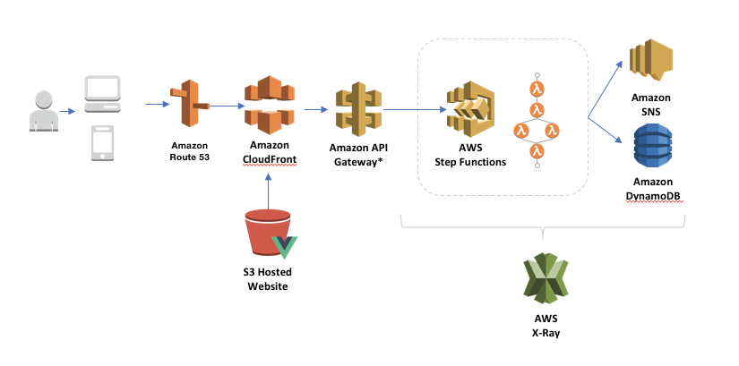
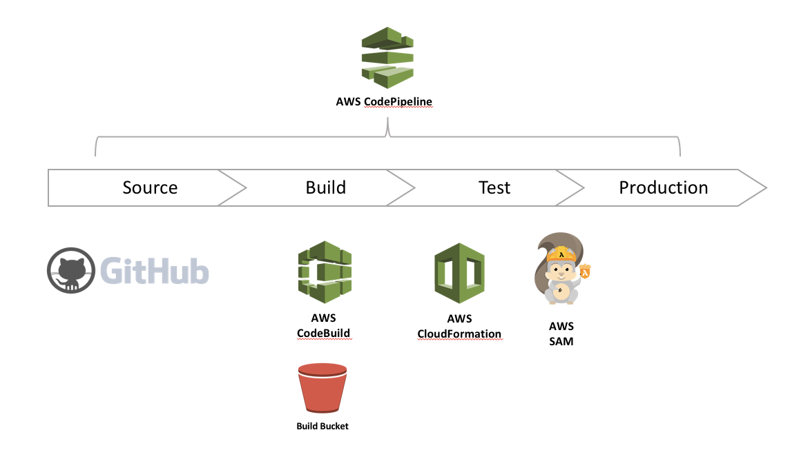

# Developing with AWS Step Functions using .NET Core

## The Scenario

To illustrate the use of [AWS Step Functions](https://aws.amazon.com/step-functions/) I have created a scenario that describes a process where university students caught plagiarising on exams and/or assignments are required to take a test to assess their knowledge of the universities referencing standards.

Visually, the process looks like this:


The process starts by:

1. Registering the plagiarism incident
2. Scheduling an exam. Students have one week to complete the test.
3. Send the student an email notification to inform them of the requirement
4. The process waits for the exam dedline to complete, before
5. Validating the results
6. Determining whether or not the student has sat the exam, or passed. Students get three attempts to pass the exam before...
    * The incident is resolved, or
    * Administrative action is taken.

## The Architecture

This example uses a simple architecture, hosting a static website in [Amazon Simple Storage Service](https://aws.amazon.com/s3/) (Amazon S3) using Vue.js to invoke an [Amazon API Gateway](https://aws.amazon.com/api-gateway/) API. The API is configured with an AWS Service integration which invokes the [AWS Step Function](https://aws.amazon.com/step-functions/) state machine for the plagiarism workflow. Along the way, the task states in the state machine are executing [AWS Lambda](https://aws.amazon.com/lambda/) functions which are periodically persisting data to [Amazon DynamoDB](https://aws.amazon.com/dynamodb/) and send messages via [Amazon Simple Notification Service](https://aws.amazon.com/sns/).



## The Deployment Pipeline

All resources for this architecture are deployed using Amazon CloudFormation and the [Serverless Application Model](https://github.com/awslabs/serverless-application-model) (SAM). SAM is a superset of CloudFormation that make deploying Serverless applications easier by providing transformations for Functions, API's and DynamoDB.

To deploy the template we simply run two AWS CLI commands in the CloudFormation API. The package takes our SAM template as an input and we specify an file name as an output. CloudFormation will package all our function code and upload it to the specified S3 bucket, substituting the Code Uri property values with the location of the zipped up functions in the S3 bucket.

``` bash
sam package \
    --template-file template.yaml \
    --output-template-file packaged.yaml \
    --s3-bucket developingwithstepfunctions
```

Once the package has been created, execute the deploy command to create the application stack

``` bash
sam deploy \
    --template-file packaged.yaml \
    --stack-name developing-with-step-functions \
    --capabilities CAPABILITY_IAM
```

Using this approach allow development teams to automate their deployments through their CI/CD pipelines and easily create discreet stacks of resources that align to environments (DEV TEST and PROD).

Services used in the pipeline include:

* [AWS Code Pipeline](https://aws.amazon.com/codepipeline)
* [AWS Code Build](https://aws.amazon.com/codebuild/)
* [AWS CloudFormation](https://aws.amazon.com/cloudformation/)



## Credits

### Cookiecutter SAM for DotNet Lambda functions

The application was initialised using the Cookiecutter SAM for DotNet Lambda functions. The cookiecutter template provides a wizard like command line experience to create a Serverless app based on SAM and .NET Core 2.1.

For more details check out Heitor Lessa's repository at `todo: enter url here`

Also, a great video tutorial on how to use the Cookiecutter (and more) can be found on the AWS Twitch channel - [Build on Serverless | Building the "Simple Crypto Service" Python Project](https://www.twitch.tv/videos/248791444##)

## Resources

### Step Functions

* [AWS Step Functions](https://aws.amazon.com/step-functions/)
* [AWS Step Functions Developer Guide](https://docs.aws.amazon.com/step-functions/latest/dg/welcome.html)
* [statelint](https://github.com/awslabs/statelint)
* [Amazon States Language](https://states-language.net/spec.html)
* [Step Functions Ruby Activity Worker](https://github.com/aws-samples/step-functions-ruby-activity-worker) example

### Reference Architectures

* [Serverless Reference Architecture: Image Recognition and Processing Backend](https://github.com/awslabs/lambda-refarch-imagerecognition)
* [Serverless Reference Architecture: Snapshot Management](https://github.com/awslabs/aws-step-functions-ebs-snapshot-mgmt)
* [Batch Architecture for Life Sciences Workloads](https://github.com/awslabs/aws-batch-genomics)
* [S3 Bucket Sync Reference](https://github.com/awslabs/sync-buckets-state-machine)
* [Step Functions Plug-In for Serverless Framework](https://github.com/horike37/serverless-step-functions)

### AWS Developer Resources

* [Serverless Application Model](https://github.com/awslabs/serverless-application-model)
* [DevOps and AWS](https://aws.amazon.com/devops/)
* [AWS Developer Tools](https://aws.amazon.com/products/developer-tools/)