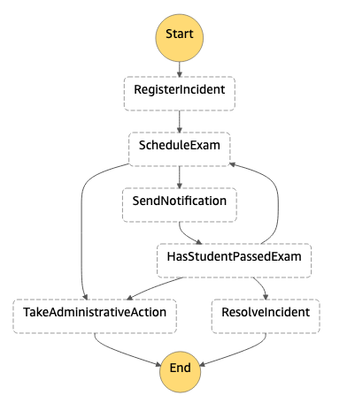
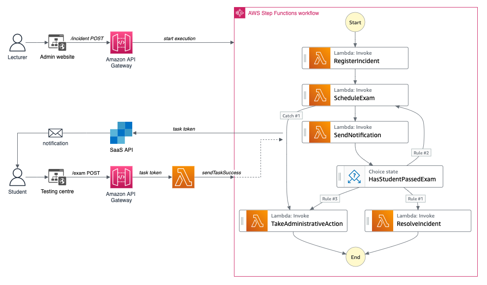
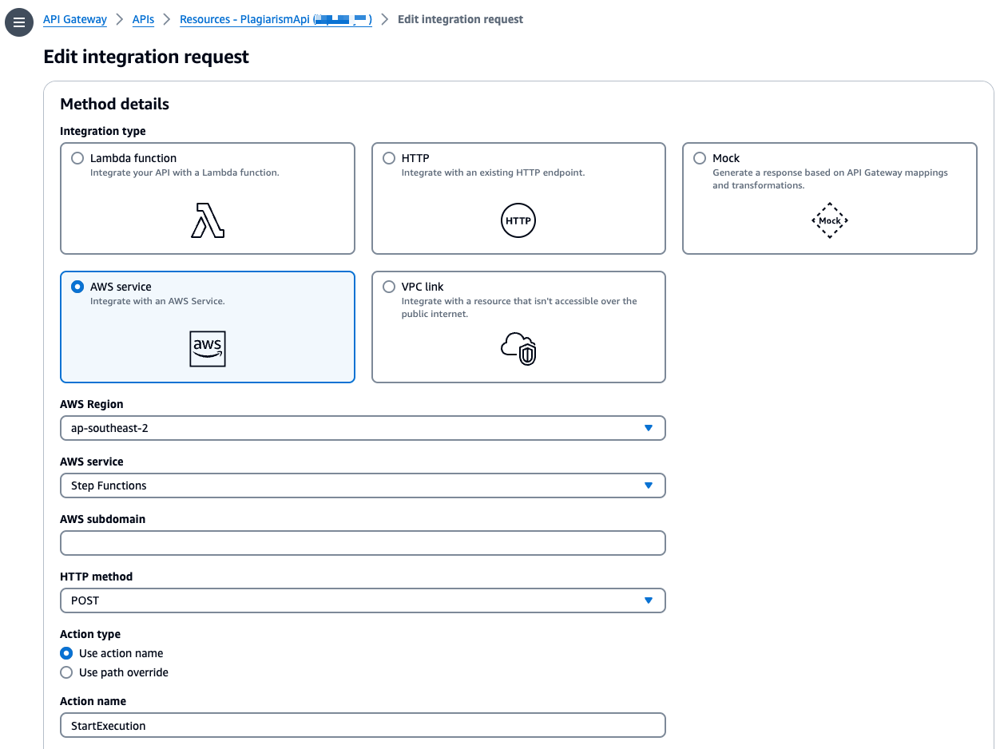

## AWS Step Functions Plagiarism Demo .NET Core

Welcome! This a simple workflow to demonstrate how you can combine [AWS Step Functions](https://aws.amazon.com/step-functions/) with [AWS Lambda](https://aws.amazon.com/lambda/), [Amazon DynamoDB](https://aws.amazon.com/dynamodb/), [AWS XRay](https://aws.amazon.com/xray/), using [Microsoft .NET Core](https://dotnet.microsoft.com/).

Along the way we provide an example of how to integrate [Amazon API Gateway](https://aws.amazon.com/apigateway/) with AWS Step Functions, and use the [AWS Step Function Service Integration Callback Pattern](https://docs.aws.amazon.com/step-functions/latest/dg/connect-to-resource.html), to interface with an external website from a manual process in the workflow. 

You will also see how we use the [AWS Serverless Application Model (SAM)](https://github.com/awslabs/serverless-application-model) to define and model your Serverless application, and use [AWS SAM CLI](https://github.com/awslabs/aws-sam-cli) to build and deploy it. 

### The Scenario

To illustrate the use of [AWS Step Functions](https://aws.amazon.com/step-functions/) I have created a scenario that describes a process where university students caught plagiarising on exams and/or assignments are required to take a test to assess their knowledge of the universities referencing standards.

Visually, the process looks like this:



The process starts by:

1. Registering the plagiarism incident
1. Scheduling an exam. Students have one week to complete the test.
1. Send the student an email notification to inform them of the requirement
1. The process waits for the student to complete the exam, then 
1. Determining whether or not the student has sat the exam, or passed

> If the student has fails the exam they are allowed to resit the exam. Students get 3 attempts to pass the exam before the incident is either resolved, or administrative action is taken.

### The Architecture



The architecture is relatively simple. There are two front end websites - one "Admin" website that capture the plagiarism incident; and a "Testing Centre" that tests the students knowledge of plagiarism.

The incident captured at via the Admin website initiates the AWS Step Function execution through an AWS Service integration on the `/incident` resource for the `POST` method.



Once the the exam is scheduled, we use an AWS Lambda service integration Task with a `.waitForTaskToken` (see [AWS docs](https://docs.aws.amazon.com/step-functions/latest/dg/connect-to-resource.html#connect-wait-token)). The Task Token is passed to the function which in turn generates the email  which is sent to the student, notifying them of the exam requirements.

``` yaml
"SendNotification": {
    "Type": "Task",
    "Comment": "Send email confirming exam details and exam deadline. Wait for callback.",
    "Resource": "arn:aws:states:::lambda:invoke.waitForTaskToken",
    "Parameters":{
    "FunctionName":"${SendExamNotificationFunction}",
    "Payload":{
        "input.$":"$",
        "TaskToken.$":"$$.Task.Token"
    }
    },
    "Next": "HasStudentPassedExam"
},
```

Once the student receives the email, the Task Token is passed to the Testing Centre. The student answers the questions and submits the results to the `/exam` resource on the API. The Lambda integration processes the TaskTaken and passes the results of the waiting execution to continue the workflow execution.


## Resources

### Step Functions

* [AWS Step Functions](https://aws.amazon.com/step-functions/)
* [AWS Step Functions Developer Guide](https://docs.aws.amazon.com/step-functions/latest/dg/welcome.html)
* [statelint](https://github.com/awslabs/statelint)
* [Amazon States Language](https://states-language.net/spec.html)
* [AWS Step Function Service Integration Callback Pattern](https://docs.aws.amazon.com/step-functions/latest/dg/connect-to-resource.html)
* [Step Functions Ruby Activity Worker](https://github.com/aws-samples/step-functions-ruby-activity-worker) example

### Reference Architectures

* [Serverless Reference Architecture: Image Recognition and Processing Backend](https://github.com/awslabs/lambda-refarch-imagerecognition)
* [Serverless Reference Architecture: Snapshot Management](https://github.com/awslabs/aws-step-functions-ebs-snapshot-mgmt)
* [Batch Architecture for Life Sciences Workloads](https://github.com/awslabs/aws-batch-genomics)
* [S3 Bucket Sync Reference](https://github.com/awslabs/sync-buckets-state-machine)
* [Step Functions Plug-In for Serverless Framework](https://github.com/horike37/serverless-step-functions)

### AWS Developer Resources

* [Serverless Application Model](https://github.com/awslabs/serverless-application-model)
* [DevOps and AWS](https://aws.amazon.com/devops/)
* [AWS Developer Tools](https://aws.amazon.com/products/developer-tools/)

## License Summary

This sample code is made available under a modified MIT license. See the LICENSE file.
