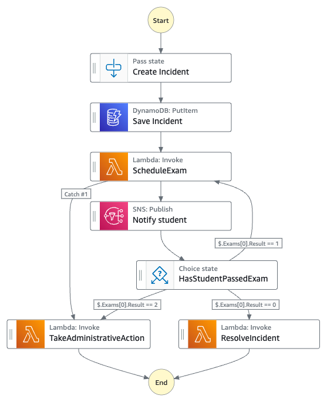
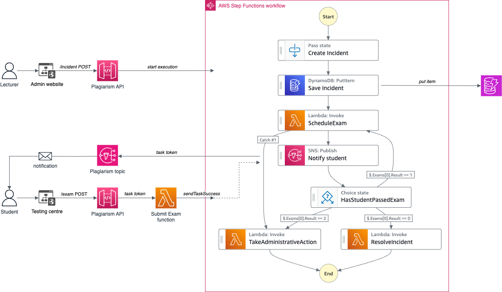
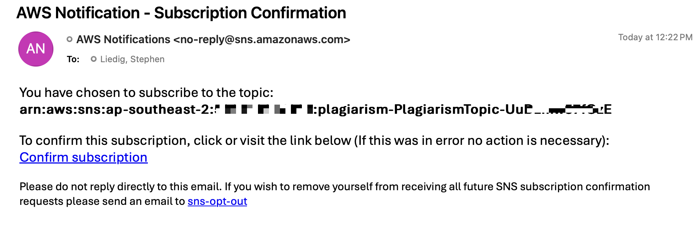
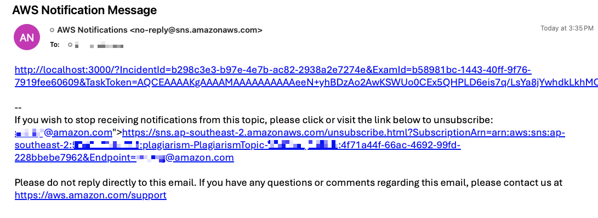

# AWS Step Functions Plagiarism Demo for .NET

This sample seeks to demonstrate how you can use implement a simple workflow using [AWS Step Functions](https://aws.amazon.com/step-functions/) and other AWS services, that involves human interaction.

It demonstrates how you can combine Step Functions, using the [service integration callback pattern](https://docs.aws.amazon.com/step-functions/latest/dg/connect-to-resource.html#connect-wait-token) to interface with a website that provides additional information throught the execution of the workflow, with [AWS Lambda](https://aws.amazon.com/lambda/), [Amazon DynamoDB](https://aws.amazon.com/dynamodb/), and [Powertools for AWS](https://docs.powertools.aws.dev/lambda/dotnet/), using the latest version of [Microsoft .NET](https://dotnet.microsoft.com/).

You will also see how we use the [AWS Serverless Application Model (SAM)](https://github.com/awslabs/serverless-application-model) to define and model your Serverless application, and use [AWS SAM CLI](https://github.com/awslabs/aws-sam-cli) to build and deploy it.

## The Scenario

The scenario is based on a real-world scenario where students are caught plagiarising on exams and/or assignments are required to take a test to assess their knowledge of the universities referencing standards. This application manages the incidents and the students' attempts to pass the exam.

The process starts by:

1. University staff registering the plagiarism incident
1. The application schedules an exam. Students have one week to complete the test
1. Student are sent an email notification to inform them of the requirement to sit the exam
1. The process waits for the student to complete the exam, then
1. Determines whether or not the student has sat the exam, passed or failed.
1. If the student has failed the exam they are allowed to resit the exam. Students get 3 attempts to pass the exam before the incident is either resolved, or administrative action is taken.

Visually, the process looks like this:



### The Architecture

The solution has three main comonents:

1. The Serverless backend application
1. The "admin" website (http://localhost:3000/admin) which is used by university staff to register plagiarism incidents.
1. The "testing centre" website (http://localhost:3000/) which is used by students to sit the exam.



The incident captured at via the admin website initiates the AWS Step Function execution through an AWS Service integration on the `/incident` resource for the `POST` method.


Once the the exam is scheduled, we use an Amazon SNS Integration Task with a `.waitForTaskToken` (see [AWS docs](https://docs.aws.amazon.com/step-functions/latest/dg/connect-to-resource.html#connect-wait-token)). The Task Token is passed to the function (using built in reference of `$$.Task.Token`) which in turn generates the email notifying the student of the exam requirements.

The result of the exam pass. Here is a sample from the state machine:

``` yaml
  Notify student:
    Type: Task
    Resource: "arn:aws:states:::sns:publish.waitForTaskToken"
    Parameters:
        TopicArn: '${NotificationTopic}'
        Message.$: "States.Format('http://localhost:3000/?IncidentId={}&ExamId={}&TaskToken={}', $.Payload.IncidentId, $.Payload.Exams[0].ExamId, $$.Task.Token)"
    Next: Has student passed exam?
```

Once the student receives the email, the Task Token is passed to the Testing Centre. The student answers the questions and submits the results to the `/exam` resource on the API. The Lambda integration processes the TaskToken and passes the results of the waiting execution to continue the workflow execution.

Tip: Use the payload in the email that is sent to you to simulate the response. Make sure you modify the score before sending it to the Plagiarism API.

## Running the demo

1. Deploy the backend using AWS SAM CLI

    ```bash
    cd src/backend
    sam build
    sam deploy --stack-name plagiarism --guided
    ```
    
    **Note:** Make sure you add your emial to the `ToEmail` parameter when prompted.

1. Once you have deployed the backend, use the AWS CLI to describe the outputs of the stack to get the API URL

    ```bash
    aws cloudformation describe-stacks --stack-name plagiarism --query "Stacks[0].Outputs[*].[OutputKey,OutputValue]" --output table
    ```

    You should see something like this:

    ```bash
    ---------------------------------------------------------------------------------------------------------------------------------------------------------
    |                                                                    DescribeStacks                                                                     |
    +--------------------------------------+----------------------------------------------------------------------------------------------------------------+
    |  TakeAdministrativeActionFunctionArn |  arn:aws:lambda:ap-southeast-2:123456789012:function:plagiarism-TakeAdministrativeActionFunction-wDDCxgR8xEOA  |
    |  ResolveIncidentFunctionArn          |  arn:aws:lambda:ap-southeast-2:123456789012:function:plagiarism-ResolveIncidentFunction-9JxQ9xDkiSyk           |
    |  ApiEndpointRegisterIncident         |  https://1a2b3c4d5e.execute-api.ap-southeast-2.amazonaws.com/dev/incident                                      |
    |  StepFunctionsStateMachine           |  arn:aws:states:ap-southeast-2:123456789012:stateMachine:PlagiarismStateMachine-dev                            |
    |  SubmitExamResultsFunctionArn        |  arn:aws:lambda:ap-southeast-2:123456789012:function:plagiarism-SubmitExamResultsFunction-fMtI5Ty58sC4         |
    |  ApiEndpointSubmitExamResults        |  https://1a2b3c4d5e.execute-api.ap-southeast-2.amazonaws.com/dev/exam                                          |
    |  ScheduleExamFunctionArn             |  arn:aws:lambda:ap-southeast-2:123456789012:function:plagiarism-ScheduleExamFunction-KBeqZL1uoinw              |
    +--------------------------------------+----------------------------------------------------------------------------------------------------------------+
    ```

1. Open the `src/frontend/.env` file in the frontend directory and update the `NEXT_PUBLIC_API_ENDPOINT` parameter with the `ApiEndpointSubmitExamResults` API URL you got from the backend output.

1. Now build and run the frontend

    ```bash
    cd src/frontend
    pnpm install
    pnpm dev
    ```

1. Open your email client. You should have an email from Amazon SNS to confirm your subscription. Click the **Confirm subscription** link in the email to confirm.

    

1. Using the `ApiEndpointRegisterIncident` API output from the previous step, register an incident by opening the admin website at http://localhost:3000/admin and clicking the "Register Incident" button.

    Alternively you can use curl to register an incident:

    ```bash
    curl --request POST \
      --url https://[YOUR API ID].execute-api.[AWS REGION].amazonaws.com/dev/incident \
      --header 'Content-Type: application/json' \
      --data '{
      "StudentId": "fd794864-e867-435f-a0e1-c4479beafda7",
      "IncidentDate": "2024-03-21T19:14:53.418Z"
    }'
    ```

    **Tip:** Use [Postman](https://www.postman.com/) or [Insomnia](https://insomnia.rest/) to dynamically alter the `StudentId` and `IncidentDate` values.

1. You should receive an email with details about your exam.

    

1. Click on the top link. This will open the testing centre website, with your incident details. At this stage you should notice that the workflow has paused and is waiting for you to complete the exam. Answer the questions and submit the exam.

    **Tip:** make sure you fail the exam to see the workflow continue.

## Resources

### Step Functions

* [AWS Step Functions](https://aws.amazon.com/step-functions/)
* [AWS Step Functions Developer Guide](https://docs.aws.amazon.com/step-functions/latest/dg/welcome.html)
* [Sample projects for Step Functions](https://docs.aws.amazon.com/step-functions/latest/dg/create-sample-projects.html)
* [statelint](https://github.com/awslabs/statelint)
* [Amazon States Language](https://states-language.net/spec.html)

### References

* [AWS Step Functions Examples](https://github.com/aws-samples/aws-stepfunctions-examples) on GitHub
* [AWS Step Functions Supports 200 AWS Services To Enable Easier Workflow Automation](https://aws.amazon.com/blogs/aws/now-aws-step-functions-supports-200-aws-services-to-enable-easier-workflow-automation/) blog post
* [AWS Step Functions Workflow Studio – A Low-Code Visual Tool for Building State Machines](https://aws.amazon.com/blogs/aws/new-aws-step-functions-workflow-studio-a-low-code-visual-tool-for-building-state-machines/) blog post

### AWS Developer Resources

* [Serverless Application Model Developer Guide](https://docs.aws.amazon.com/serverless-application-model/latest/developerguide/what-is-sam.html)
* [AWS::Serverless::StateMachine](https://docs.aws.amazon.com/serverless-application-model/latest/developerguide/sam-resource-statemachine.html)
* [AWS Toolkit for Visual Studio Code](https://aws.amazon.com/visualstudiocode/)

## License Summary

This sample code is made available under a modified MIT license. See the LICENSE file.
